# UP-MAVT Suite: User Manual and Tutorial

UP-MAVT Suite is an open-source web application for **multi-criteria decision analysis (MCDA) under uncertainty**. It helps a group of people choose between several options ("alternatives") when those options must be judged against several, often conflicting, criteria, and when the data behind those criteria is itself uncertain.

It implements the **UP-MAVT** framework (Uncertainty-Propagated Multi-Attribute Value Theory): a Monte Carlo simulation propagates uncertainty from the raw input data, through each person's individually elicited preferences, all the way to a final ranking of alternatives, so the result reflects not just "which option wins" but *how confidently* it wins.

The software is built for two kinds of users:

- **Practitioners**: the analyst running the study. They define the case study, set up sessions for each decision-maker, and run the analysis pipeline that turns individual preferences into a final, uncertainty-aware ranking.
- **Decision-makers**: people whose preferences are being elicited. No MCDA background is assumed; the interface guides them through simple, visual questions (drag-and-drop ranking, sliders, side-by-side comparisons).

This manual is a single, start-to-finish **tutorial**, written for someone who has never opened the software before. It follows a real (fictional) case study, a port authority choosing among seven candidate ports across six criteria, from the moment a practitioner creates it, through a decision-maker's elicitation session, to the practitioner reviewing the final, computed ranking. Everything is captured live from the running application, in the order you would actually click through it.

If you're only interested in one role, you can jump straight to [Part 3](#part-3-complete-an-elicitation-session-decision-maker) (decision-maker), or read the practitioner parts ([1](#part-1-set-up-a-case-study-practitioner), [2](#part-2-invite-decision-makers-practitioner), [4](#part-4-run-the-analysis-practitioner)) on their own. However, a session code and a case study must exist before a decision-maker can do anything, so the practitioner steps necessarily come first.

---

## Table of contents

1. [Getting started](#getting-started)
2. [How the software is organized](#how-the-software-is-organized)
3. [Part 1: Set up a case study (practitioner)](#part-1-set-up-a-case-study-practitioner)
4. [Part 2: Invite decision-makers (practitioner)](#part-2-invite-decision-makers-practitioner)
5. [Part 3: Complete an elicitation session (decision-maker)](#part-3-complete-an-elicitation-session-decision-maker)
6. [Part 4: Run the analysis (practitioner)](#part-4-run-the-analysis-practitioner)
7. [Glossary and FAQ](#glossary-and-faq)

---

## Getting started

The fastest way to try UP-MAVT Suite is the hosted deployment, no installation needed:

**https://mcda-up.psi.ch**

Open the link and continue with [Part 1](#part-1-set-up-a-case-study-practitioner) below.

To self-host the application instead (Docker Compose, environment variables, email/OAuth2 setup), see the [README](../README.md) in the repository root. Once it's running, open the app's URL (**http://localhost:3000** for a local deployment) and continue with [Part 1](#part-1-set-up-a-case-study-practitioner) below in the same way.

---

## How the software is organized

Everything happens in a single web app with three steps, as shown on the landing page:

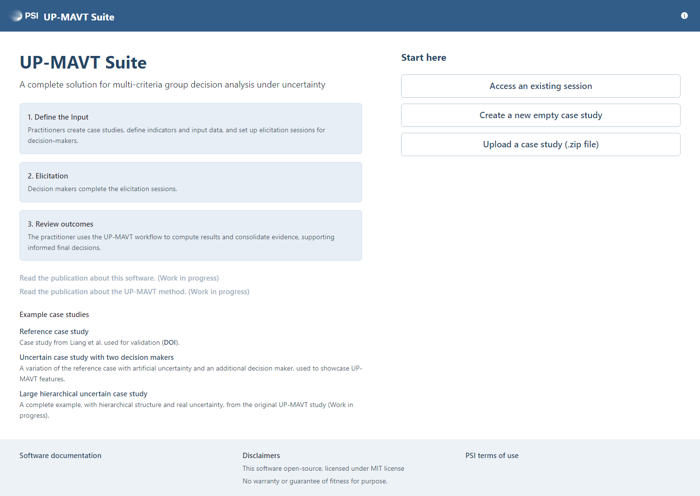
*The landing page: a decision-maker clicks "Access an existing session"; a practitioner creates or uploads a case study.*

1. **Define the input**: a practitioner creates a case study, namely the alternatives, the criteria, and the (possibly uncertain) data behind each one. *(Part 1 below.)*
2. **Elicitation**: one or more decision-makers each complete a guided session recording their personal preferences. *(Parts 2 and 3 below.)*
3. **Review outcomes**: the practitioner runs the analysis pipeline to compute weights, check consensus and uncertainty, and produce a final ranking. *(Part 4 below.)*

Access to the app is by **session code**, a short identifier generated by the software and shared by the practitioner. There are no user accounts or passwords for decision-makers: whoever holds a session's code can open it from the landing page's **"Access an existing session"** button. A practitioner uses the same mechanism, with a **study code**, to return to a case study they created earlier.

---

## Part 1: Set up a case study (practitioner)

Before anyone can be asked for their preferences, someone has to describe the decision problem itself. That's what this part does: create a case study, list the alternatives and criteria, and enter the data behind them.

### 1. Create or open a case study

From the landing page, a practitioner has three options:

- **"Create a new empty case study"**: start from scratch.
- **"Upload a case study (.zip file)"**: restore a case study previously exported from this software (useful for the [example case studies](../examples/) bundled with the repository, or for moving a study between deployments).
- **"Access an existing session"**: re-open a case study you (or a colleague) created earlier, using its study code.

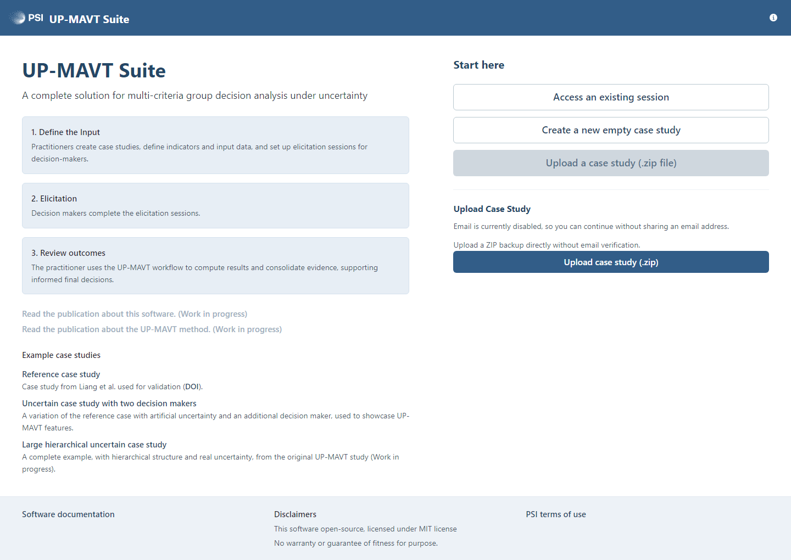
*Uploading a previously exported case study, the fastest way to try the software with real data.*

For this tutorial, click **"Create a new empty case study"**. Whichever route you take, you land on the **Input Definition** page, and the app gives you a **study code** to save and share. If you provide an email address and opt in, the code is also sent there, which we recommend so you don't lose access to your sessions. Write the code down, since you'll use it to come back to this case study later.

### 2. Input Definition: building the decision matrix

This is where you describe the decision problem: the alternatives (rows) and criteria (columns), and, for every alternative/criterion pair, the data behind it.

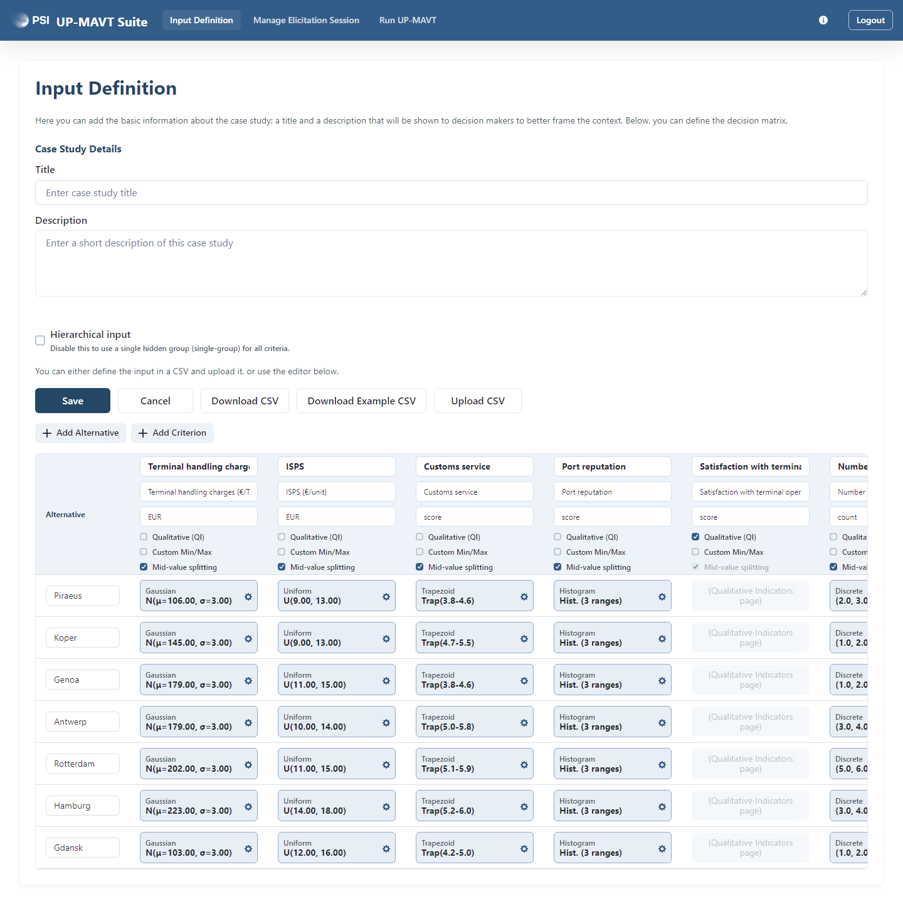
*A completed input matrix. Each cell's value is not a single number but a probability distribution; the small badge under each criterion name (Gaussian, Uniform, Trapezoid, Histogram, Discrete, ...) shows which kind.*

For each criterion you set:
- A **name**, **unit**, and optional **description**.
- Whether it's **Qualitative** (its values will be elicited from decision-makers instead of entered here; such cells appear greyed out, marked "(Qualitative Indicators page)").
- Whether decision-makers should use **mid-value splitting**, the standard technique described in [Part 3, step 3](#3-quantitative-defining-value-functions-for-numeric-criteria) below. Alternatively, you can enable **free edit**, which gives decision-makers the freedom to add their own points and shape the curve however they like; this is not a standard MCDA practice, but it is offered for flexibility.
- Optionally a **group**, if "Hierarchical input" is enabled (useful for large studies with many criteria, so weight comparisons stay manageable; see [Part 3, step 4](#4-weights-comparing-criteria-against-each-other) below).

You can build the matrix by hand (**Add Alternative** / **Add Criterion**, then click each cell to edit it) or by uploading a CSV in one go (a **Download Example CSV** button gives you a template to start from).

Because the real world is uncertain, every non-qualitative cell isn't just a single number: it is defined as a **probability distribution**. Clicking a cell opens the distribution editor:

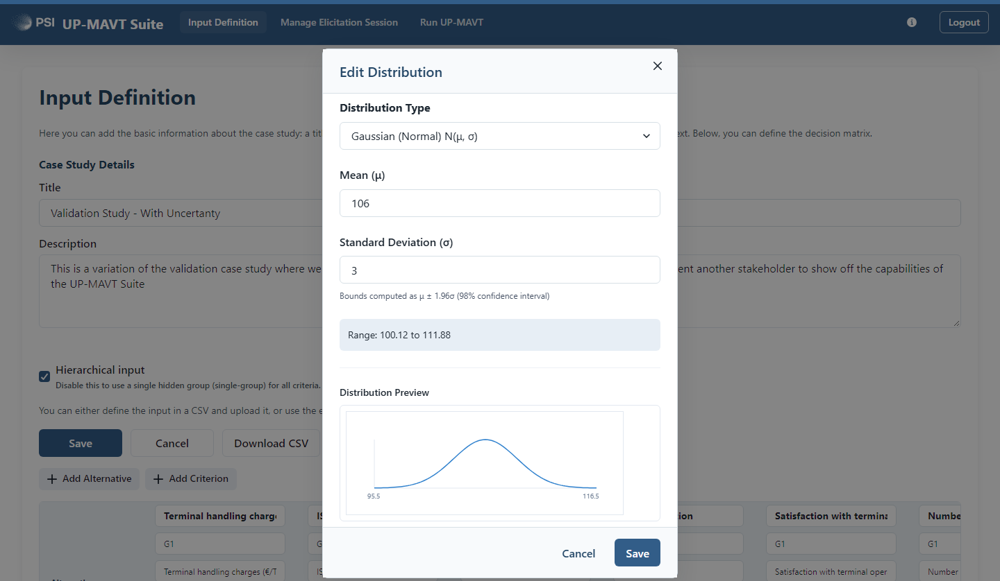
*Setting a Gaussian (Normal) distribution for one cell; the preview chart and computed range update live.*

The available distribution types cover most practical cases: a single certain value; a Gaussian (mean and standard deviation); a uniform range; a value with an absolute or percentage error margin; an arbitrary discrete set of equally-likely values; a histogram of ranges with their own probabilities; a triangular or trapezoidal shape; or a categorical (0/1/2) distribution for edge cases. Every cell's uncertainty is later propagated all the way through to the final ranking by the Monte Carlo engine; this is what "input data uncertainty" means throughout the rest of the software.

Once you're happy with the matrix, click **"Save"** to lock it back in. If elicitation sessions already exist, the software warns you that editing the input will reset any sessions affected by the change, so decision-makers don't end up working from stale data.

---

## Part 2: Invite decision-makers (practitioner)

With the case study defined, the next step is to create a session for each person whose preferences you want to elicit.

### 3. Manage Elicitation Session: inviting decision-makers

On the **"Manage Elicitation Session"** page (the page itself is titled "Case Study"), click **"Create New"** to generate a new session. The software generates a unique **session code** automatically; share it with the corresponding decision-maker (or open the session yourself, if you're running the elicitation in person).

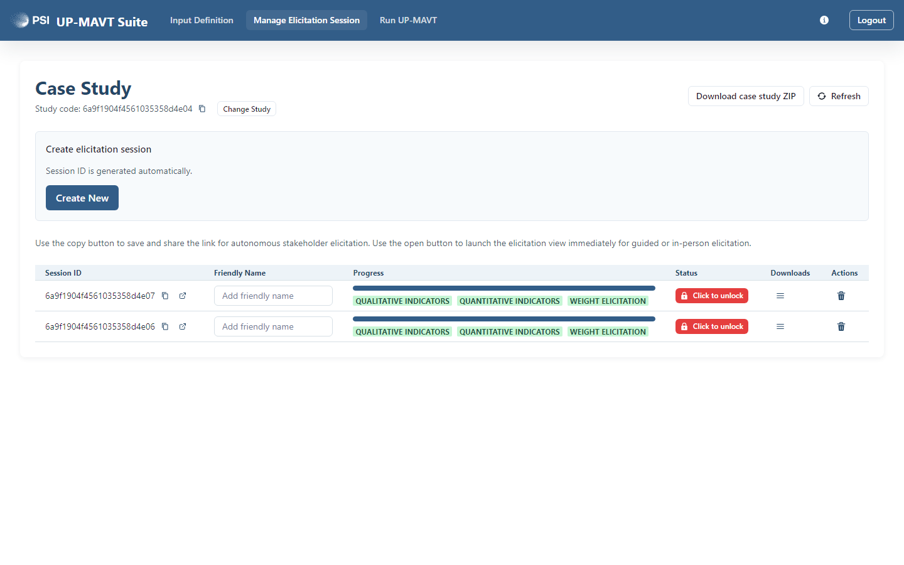
*Two decision-maker sessions, both fully elicited (green progress badges) and locked, ready to be used in the analysis.*

The table shows, per session: a friendly name you can set for your own reference, a progress bar broken down by Qualitative / Quantitative / Weight Elicitation completion, and a **lock/unlock toggle**. **Locking a session freezes it**, which is required before the analysis pipeline will use it, so that results can't shift under you mid-computation. The download menu lets you export any step's data as CSV once it's complete.

---

## Part 3: Complete an elicitation session (decision-maker)

This part switches perspective: you're now the decision-maker who just received a session code from the practitioner (obtained from the Manage Elicitation Session page). This tutorial follows a single elicitation session through the same seven-port case study.

### 1. Access your session

On the landing page, click **"Access an existing session"**, enter the **session code** your practitioner gave you, and click **"Access session"**. No email or extra sign-up is needed: the code is your only credential. If the code isn't recognized, a message will tell you to double-check it with your practitioner.

Once inside, the top navigation bar shows the steps that apply to your study: **Overview**, **Qualitative Indicators**, **Quantitative**, **Weights**. A study may enable only some of these, depending on what the practitioner configured.

Your answers **save automatically** as you work (a fraction of a second after each change); there is no explicit "Submit" button. The **Overview** tab always shows you a checklist of what's complete and what's still missing.

### 2. Qualitative Indicators: ranking and scoring

Some criteria are **qualitative**: rather than a hard number, you express your judgement directly. For each such criterion you go through a short two-step wizard.

**Step 1, rank the alternatives.** Drag the alternatives into tiers, best at the top. Alternatives placed in the same tier count as tied. Drop an alternative on one of the small "+" markers to create a new tier between two existing ones.

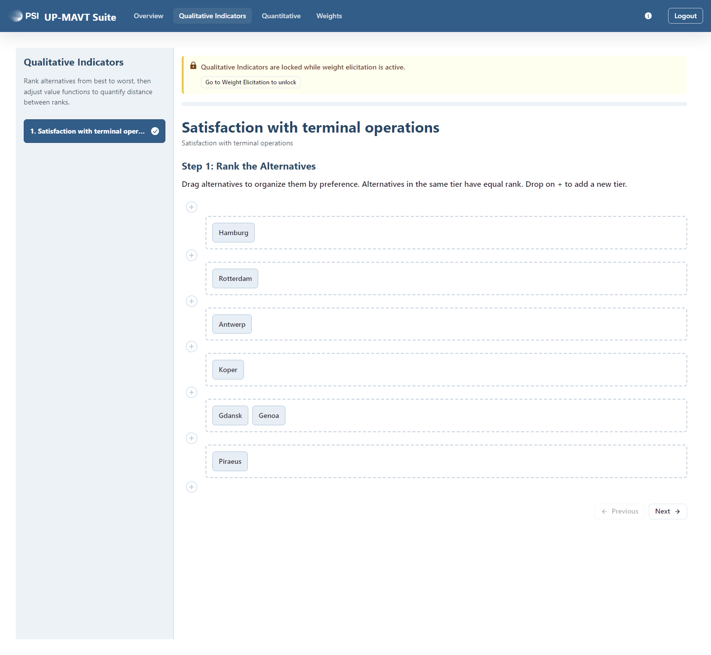
*Ranking alternatives by dragging them into tiers; ties are allowed (here Gdansk and Genoa are tied).*

**Step 2, turn the ranking into a value function.** Now you decide *how much* better each tier is than the next, using a slider per tier (0 = worst possible, 1 = best possible). A live chart on the left redraws itself as you move the sliders, so you can see the shape of your judgement: is the improvement gradual, or is there a big jump between two tiers?

For each tier you also pick a **confidence level** (0 to 4, from "Not confident" to "Fully confident"). Lower confidence widens the uncertainty margin shown around your value on the chart, drawn as an error bar; the software accounts for that uncertainty in later steps.

In this example, Hamburg's satisfaction with terminal operations is judged the best it could possibly be. Antwerp, Koper and Rotterdam are tied for second place, and close to each other. Gdansk and Genoa are tied for third, with a much larger gap from the second tier. Piraeus comes last, though its value doesn't drop all the way to zero, meaning it is judged poor but not the worst possible.

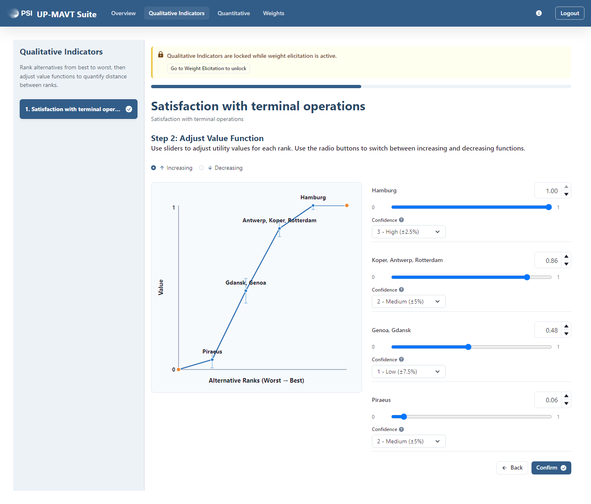
*Setting how much better each tier is, with a confidence level per judgement.*

Click **"Confirm"** to save and move to the next indicator.

### 3. Quantitative: defining value functions for numeric criteria

For criteria that already come with numeric data (e.g. cost, distance, a count), you don't rank alternatives: instead you define a **value function**, a curve that turns the raw numeric value into a 0 to 1 desirability score, so criteria measured in different units (euros, kilometers, a count of terminals, ...) become comparable.

The standard practice we implemented is **mid-value splitting** (the default): a short wizard asks whether the criterion is increasing or decreasing, has you set a confidence level and the low and high thresholds beyond which further change no longer matters, and then asks one to three simple questions such as *"At which point X is equally important to improve from {low} to X as from X to {high}?"* This locates the "indifference points" that define the curve. The wizard also asks you to rate your confidence in each judgement on a scale from 0 to 4, which is translated into an uncertainty error band around the value function (the shaded area).

There is also a **Free edit** option, for researchers who want more freedom to experiment with the shape of this function. It lets you place points directly on the graph and drag them into shape, which is useful when your judgement doesn't follow a simple bend: you create points on the graph and move them until the curve matches the shape you intend.

Either way, the resulting curve is always shown on the same chart, with the thresholds marked and a shaded confidence band:

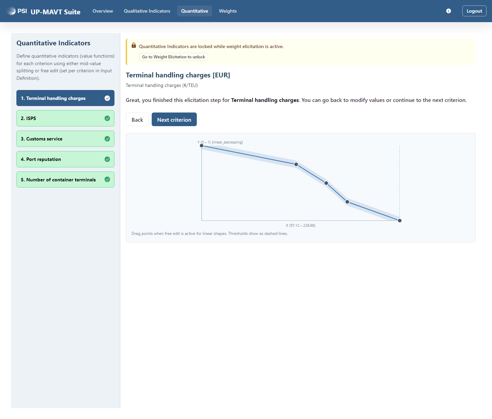
*A finished value function: as the criterion gets worse (further right), desirability drops towards the threshold.*

### 4. Weights: comparing criteria against each other

The **Weights** step is where you say how much each criterion matters *relative to the others*; this is what ultimately produces the numeric weights used in the final ranking. Because this uses your qualitative and quantitative judgements as reference points, the software asks you to lock those two steps first (a button on this page does that for you in one click; you can always unlock them again if you need to revise something, but doing so pauses the weight comparisons).

If your criteria are organized into groups, you'll compare criteria within each group first, and then compare the "best" and "worst" criterion of each group against each other; this keeps the number of comparisons manageable even for large studies.

For each pairwise comparison, you're shown a simple, visual trade-off:

> On the left, all criteria are at their worst except **{criterion A}**, which is at its best.
> On the right, decide how much **{criterion B}** must improve to compensate for the loss of **{criterion A}**.

You answer with a single slider, dragging **{criterion B}**'s value (in its own real-world units) until you feel the two scenarios are equally good. Two bar charts ("Baseline scenario" vs "Compensated scenario") and a small chart of the relevant value function update live as you move the slider, so you can see exactly what you're comparing.

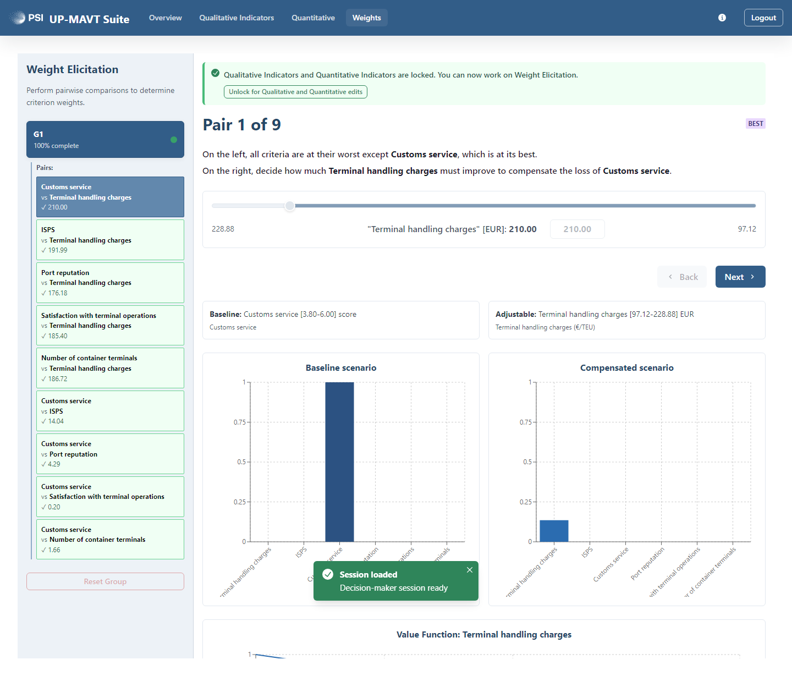
*Answering "how much would Terminal handling charges need to improve to make up for losing Customs service?"*

The software checks each new answer against your previous ones for **consistency**. If an answer would contradict an earlier one, you'll see a warning explaining the valid range. If your earlier answers leave no room at all, the slider is locked to the one value that stays consistent, with an explanation and the option to go back and loosen an earlier answer instead.

Once every comparison in a group is answered, move to the next group, or finish the last one to go straight to the Overview page.

### 5. Overview: checking you're done

The **Overview** tab is a plain status page: a checklist showing which of Input Definition, Qualitative Indicators, Quantitative Indicators and Weight Elicitation are complete. When everything is green, a confirmation message tells you your part is done and you can safely close the page.

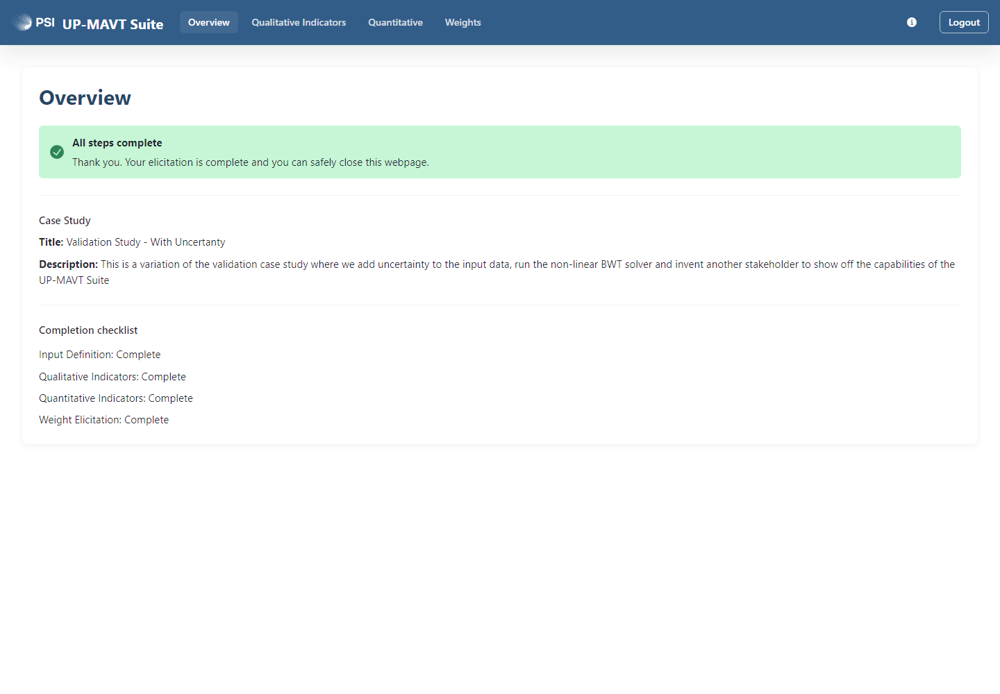
*Nothing left to submit: once every checklist item is green, you're finished.*

At this point, the decision-maker's job is done. Everything from here on happens back on the practitioner's side.

---

## Part 4: Run the analysis (practitioner)

Back as the practitioner: once every decision-maker you invited has finished (or you've decided to proceed with the ones who have), it's time to turn their individual sessions into a final, uncertainty-aware ranking.

### 4. Run UP-MAVT: the analysis pipeline

Return to the case study with your study code, open **"Manage Elicitation Session"**, and check that every session you want to include shows **complete and locked** progress (see [Part 2](#part-2-invite-decision-makers-practitioner) above; lock any session that isn't yet). Then open **"Run UP-MAVT"**. Only completed, locked sessions can be selected here, by design; this is the software's way of guaranteeing the data feeding the analysis is final. The page explains its two Monte Carlo modes up front:

> SMC (Strict Monte Carlo) is used to produce per-decision-maker results, generating a value distribution for each alternative and for each decision maker; these outputs support the analysis phase. NSMC (Non-Strict Monte Carlo), in contrast, pools subjective information across decision-makers to produce one conservative, aggregated value distribution per alternative.

(See the [glossary](#glossary-and-faq) below for a plain-language version of this distinction.)

The pipeline is a five-step workflow, run in order:

#### Step 1: Compute Weights

Click **"Run Compute Weights"**. This turns each decision-maker's pairwise weight comparisons into an actual set of numeric weights per criterion, using either a **linear** model (a single, deterministic weight set) or the default **non-linear** model (a whole feasible *space* of weight sets, sampled to show the range of solutions consistent with the comparisons). This step must complete before any other step becomes available.

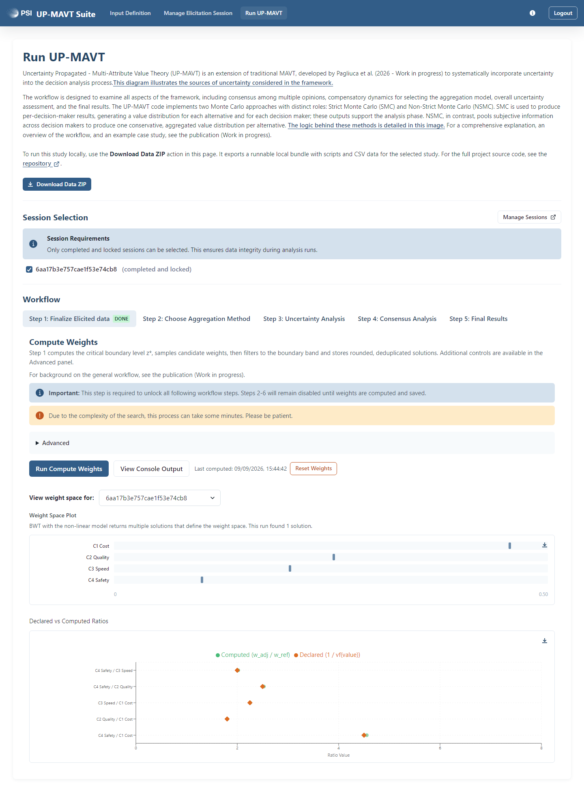
*Weight computation results: the weight space for one decision-maker, and a check of how closely the computed weights reproduce that decision-maker's original trade-off answers. Here the two curves line up closely, a sign of a consistent set of trade-off answers.*

#### Step 2: Choose Aggregation Method

Individual decision-makers rarely agree perfectly, so their results must be combined ("aggregated") into one collective picture. Pick one or more of the three available methods and click **"Run Aggregation Analysis"**:

- **WAM** (Weighted Arithmetic Mean): a simple weighted average; a weak criterion can be offset by a strong one.
- **GEO** (Geometric Mean): rewards balance across criteria; a very poor score on one criterion pulls the total down harder.
- **HAR** (Harmonic Mean): punishes weak criteria even more strongly than the geometric mean.

The result is a **ranking heatmap** per method: rows are ranks (1st, 2nd, ...), columns are alternatives, and each cell is the percentage of Monte Carlo runs in which that alternative landed at that rank. Comparing the three heatmaps side by side tells you how sensitive the ranking is to the choice of aggregation method: the more they agree, the more robust the conclusion.

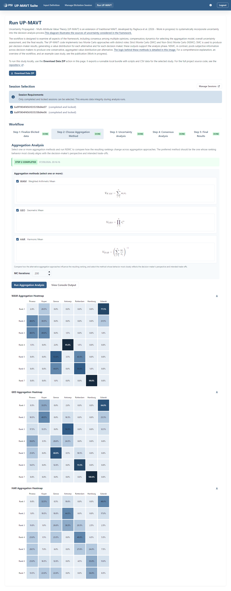
*Comparing how the three aggregation methods rank the ports: Gdansk and Piraeus/Koper dominate the top ranks under all three, a reassuring sign.*

#### Step 3: Uncertainty Analysis

Pick the aggregation method you found most representative, then click **"Run Uncertainty Analysis"**. This produces one chart per alternative, showing each decision-maker's individual value distribution (SMC, not aggregated). Wide, overlapping curves mean more uncertainty in that alternative's score; narrow, well-separated curves mean the model is confident.

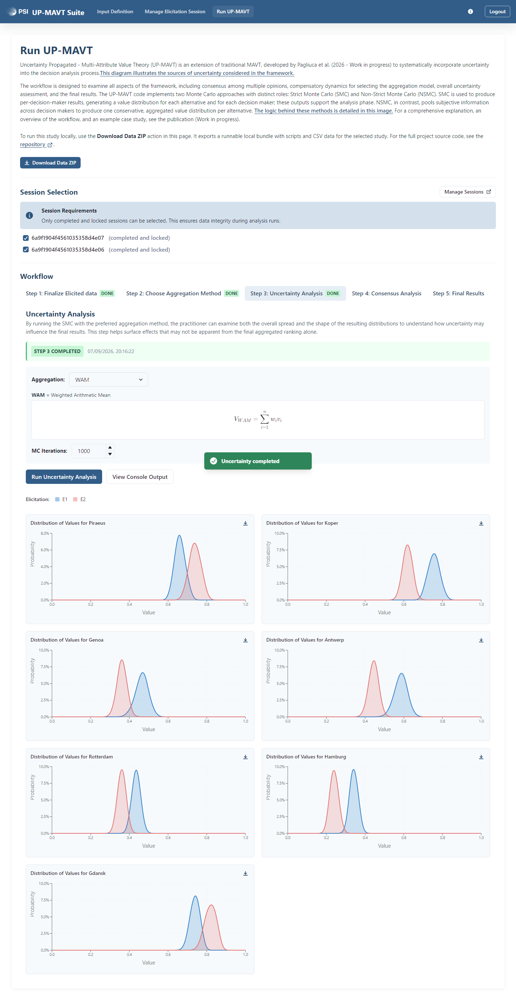
*How much each alternative's value could plausibly vary, per decision-maker, before aggregation.*

#### Step 4: Consensus Analysis

Same mechanics as Step 3, but interpreted differently: here you're checking **how much the decision-makers agree with each other**, not how uncertain any one of them is. Where the curves for the two (or more) decision-makers overlap heavily, there's consensus; where they're clearly separated, the group disagrees on that alternative and it may be worth a discussion before finalizing.

A quantitative evaluation of consensus is currently being developed.

#### Step 5: Final Results

Click **"Run Results"**. This re-runs the aggregation with a much larger number of Monte Carlo samples (up to 10,000, versus a few hundred to a few thousand in the earlier exploratory steps) to produce the final, publication-quality **Results Heatmap**, in the same rank-probability format as Step 2, but now this is the number you report.

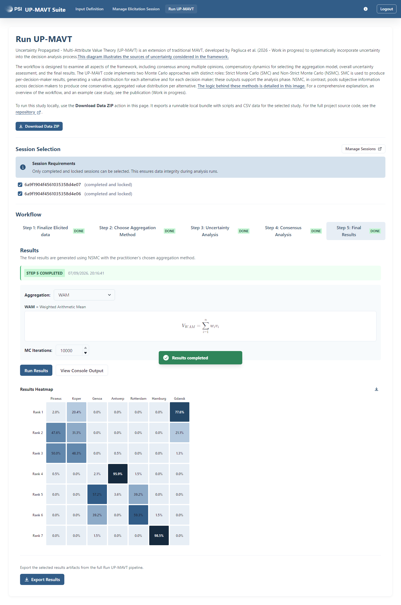
*The final ranking: Gdansk is the clear top choice, followed closely by Piraeus and Koper.*

An **"Export Results"** button lets you download the final ranking as CSV, the raw simulation data for every step, plot images, or a full bundle for local replication (a **"Download Data ZIP"** button at the top of the page similarly exports a runnable local bundle with scripts and CSVs, for anyone who wants to reproduce a run outside the app).

That's the whole cycle, start to finish: a practitioner defines the problem (Part 1), invites decision-makers (Part 2), each decision-maker records their preferences (Part 3), and the practitioner turns those preferences into a ranking (Part 4).

---

## Glossary and FAQ

**Value function**: a curve that converts a criterion's raw value (in its own unit, euros, a score, a count, ...) into a 0 to 1 "desirability" score, so criteria measured on different scales become comparable and combinable.

**Weight**: a number representing how much a criterion matters relative to the others, derived from a decision-maker's pairwise trade-off answers.

**Confidence level**: a 0 to 4 self-declared rating of how sure you are about a given judgement, used to widen or narrow the uncertainty band shown around that judgement (and, ultimately, propagated into the Monte Carlo simulation).

**Aggregation**: combining several decision-makers' (or several criteria's) individual results into one collective value, using one of three methods: WAM (weighted average), GEO (geometric mean), or HAR (harmonic mean). See [Step 2](#step-2-choose-aggregation-method) above for what each implies in practice.

**SMC vs. NSMC (Strict vs. Non-Strict Monte Carlo)**: two different roles the same Monte Carlo engine plays:
- **SMC** keeps each decision-maker's simulated results separate, producing one value distribution per alternative *per decision-maker*. Used to study individual uncertainty (Step 3) and cross-decision-maker consensus (Step 4).
- **NSMC** pools all decision-makers' subjective judgements together before simulating, producing one conservative, combined value distribution per alternative. Used to produce the group-level ranking (Steps 2 and 5).

**Indifference point / mid-value splitting**: a technique for defining a value function by asking, instead of "what's your curve", a simpler question: "at which value would you consider this change exactly as valuable as that other change?" The software uses your answer to locate points on the curve for you.

**Threshold (low/high)**: for a quantitative criterion, the values beyond which further improvement (or worsening) is considered to no longer change desirability. The value function flattens out past these points.

**Criterion group / "intra-B" / "intra-W"**: when a study has many criteria, they can be organized into groups so that pairwise weight comparisons stay within a manageable number. "intra-B" and "intra-W" are the extra, automatically-generated comparisons between the best (respectively, worst) criterion of each group, used to make the groups' weights comparable to each other.

**Consistency (in weight elicitation)**: the software checks that each new pairwise-comparison answer doesn't contradict your earlier ones (e.g., that if A beats B and B beats C, your answer for A vs. C is compatible). Inconsistent or over-constrained answers are flagged, with an explanation of the valid range or, if none remains, an explanation of why a value has been forced.

**Session code**: the only credential a decision-maker needs, a code generated by the software when a session is created, shared by the practitioner, and entered on the landing page under "Access an existing session". Practitioners use the same mechanism with their **study code** to return to a case study.

**Locking**: freezing a piece of data so it can no longer be edited. Both the input matrix and individual elicitation sessions can be locked; the analysis pipeline only accepts sessions that are both complete and locked, to guarantee results are computed from final, unchanging data.

**Linear vs. non-linear weight model**: a setting for Step 1 of the analysis pipeline. The linear model returns a single, deterministic set of weights per decision-maker. The non-linear model instead explores the full space of weight sets consistent with that decision-maker's comparisons, which can return several valid solutions rather than one.
